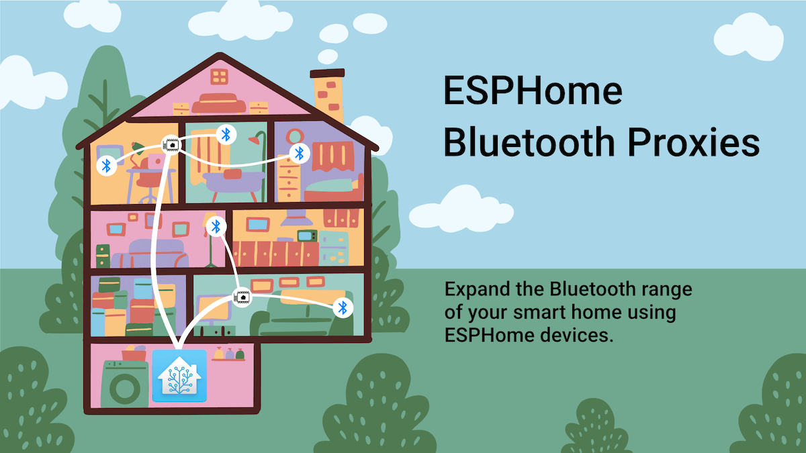

# ESPHOME POE Bluetooth Proxy/Zigbee

UZG-01 utilizes ESP32 chip so can be used as a [ESPHome Bluetooth Proxy adapter for Home Assistant](https://esphome.github.io/bluetooth-proxies/).

{ data-title="UZG-01 - ESPHome Bluetooth proxy mode" .off-glb }

So with UZG-01 you can have:

- ESPHome Bluetooth Proxy
- ESPHome BTProxy & Zigbee (Mixed)

!!! warning "ESPHome BTProxy & Zigbee - Not recommended"
    Use at your own risk,may occur interference between Zigbee & Bluetooth 
    Recommended to test very well before using in production environment 

???+ note
    All ESPHome based firmware's are working over Ethernet. 
    For Wifi please download .yaml file and edit accordingly.

**How to set-up your UZG-01 as ESPHome Bluetooth proxy**

You can install using two methods described below:

### Web Installation

<ol>
  <li>Plug in your UZG-01 to a USB port. Select firmware for your device</li>
  <li id="coms">Hit "Install" and select the correct COM port. <a onclick="showSerialHelp()">No device found?</a></li>
  <li>Get UZG-01 selected firmware installed and connected in less than 3 minutes!</li>
</ol>

<select>
    <option value="https://raw.githubusercontent.com/mercenaruss/zigstar_gateways/main/files/ESP-HOME/zigstar-gw-lan/langw-btproxy.json" > ESPHome BTProxy</option>
    <option value="https://raw.githubusercontent.com/mercenaruss/zigstar_gateways/main/files/ESP-HOME/zigstar-gw-lan/langw-mixed.json" > ESPHome Mixed</option>
</select>
<esp-web-install-button class="button-connect">
  <button slot="activate" class="md-button md-button--primary">INSTALL</button>
  Use Chrome Desktop
  Not allowed to use this on HTTP!
</esp-web-install-button> 
 Powered by <a href="https://esphome.github.io/esp-web-tools/" target="_blank">ESP Web Tools</a> 

### Manual Installation

1. Generate ESPHome firmware based on the following ESPHome BTProxy YAML configuration files:

  <form id="downloadyaml" onsubmit="this.action = document.getElementById('yaml').value">
    <select id="yaml">
        <option value="https://raw.githubusercontent.com/mercenaruss/zigstar_gateways/main/files/ESP-HOME/zigstar-gw-lan/langw-btproxy.yaml" > ESPHome BTProxy</option>
        <option value="https://raw.githubusercontent.com/mercenaruss/zigstar_gateways/main/files/ESP-HOME/zigstar-gw-lan/langw-mixed.yaml" > ESPHome Mixed</option>
    </select>
    <input type="submit" value="Download" class="button" >
  </form>

2. Flash you generated firmware to your UZG-01's ESP32 chip following the [Official manual](flashing-and-updating.md/#update-esp32).
3. Follow official [ESPHome BTProxy component documentation](https://esphome.io/components/bluetooth_proxy.html) for proper end-devices set-up.

