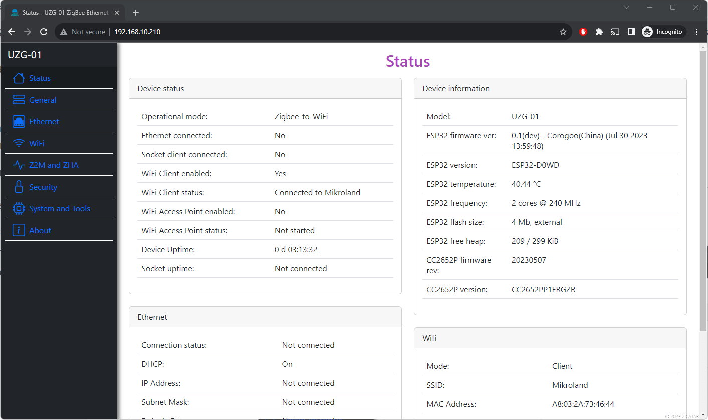
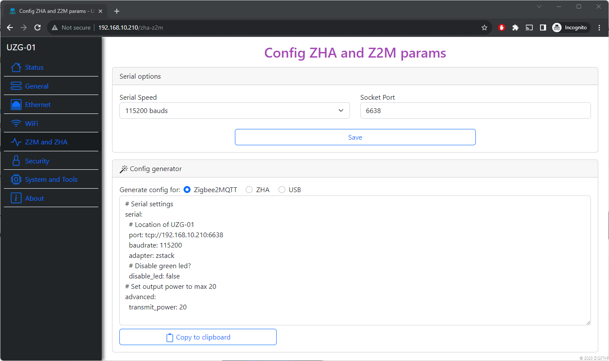
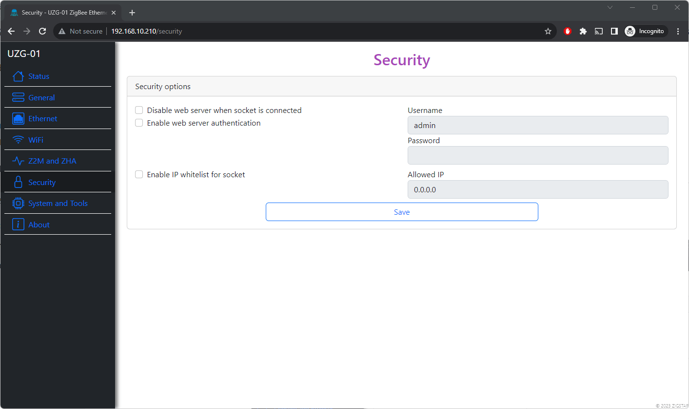
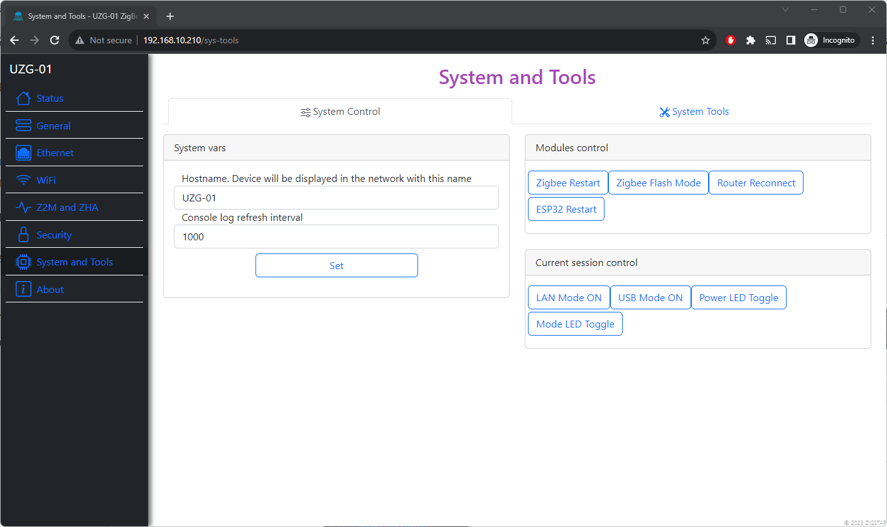
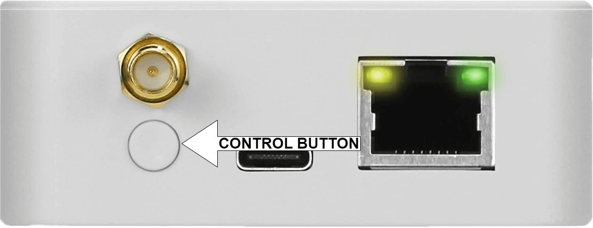

# Configuration

The UZG-01 adapter can be configured either via a physical button or via the web interface.

## Configuring with Web-interface
To configure the operation via the web interface, connect the device to your LAN network and enter the IP address of the device in the browser of your laptop or phone. 

!!! tip
        UZG-01 adapter supports mDNS. If you do not know the adapter's IP address - just go to the address uzg-01.local in your browser (will work if your router supports mDNS)

Main parameters of the web interface:

- **"Status"** -  the current status of the device; no settings are available.
{ data-title="Page - Home" data-gallery="Web Interface"}
- **"General"** - Setting the device operation mode, LED operation mode,disable LED.
{ data-title="Page - General" data-gallery="Web Interface"}
- **"Ethernet"** - Ethernet settings (DHCP, IP address, etc.)
- **"WiFi"** - Setting up access via WiFi.
- **"Z2M & ZHA"** - Setting up access via Serial interface, configuration generator.
{ data-title="Page - Z2M & ZHA" data-gallery="Web Interface"}
- **"Security"** - Setting security parameters, such as login, disabling the web interface,IP whitelist.
{ data-title="Page - Security" data-gallery="Web Interface"}
- **"System & Tools** - General system features such as over-the-air updates, rebooting ESP32 and CC2652P,hostname.
{ data-title="Page - System & Tools" data-gallery="Web Interface"}
- **"About"** - Here you can open ticket,get access to manual,last firmware,open an issue on Github.

## Configuring with Button
Using the physical button, the following settings are possible:

1. Changing the device operating mode from Zigbee-to-Ethernet to Zigbee-to-USB and vice versa. The operating mode of the device is changed by short pressing the button.
2. Controlling the behaviour of LEDs. Long press - turns off the LEDs. Another long press - switches the LEDs to the default operating mode.

{ data-title="Control Button" data-gallery="Control Button" .skip-lightbox}

!!! tip
    Button controls LED with rebooting. You can toggle LEDs without rebooting via web-interface (see System and Tools)

## Reset to factory defaults

Follow next procedure:

1. Switch off UZG-01
2. Hold Button pressed during power up for 6-10 seconds
3. You device is reset to factory defaults