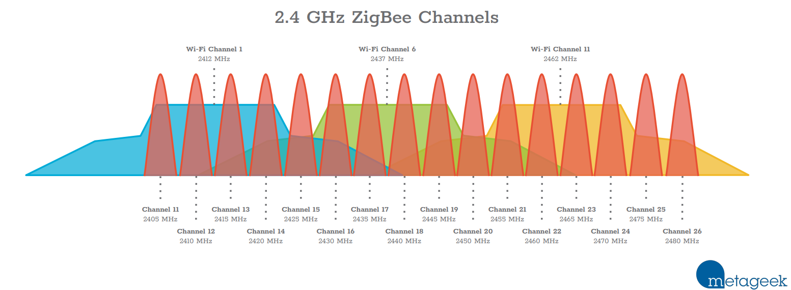

# FAQ ans Lifehacks  

## Good to know  
### Best channel for a Zigbee network  
According to this [article by Metageek](https://support.metageek.com/hc/en-us/articles/203845040-ZigBee-and-Wi-Fi-Coexistence) the best is to use channel 15 for Zigbee and channels 1,6 and 11 for your home WiFi networks.

{ data-title="UZG-01 Zigbee Channels" data-description="Wifi and Zigbee Channels Coexistence" }

The rule - make the networks as less overlaps as possible.  
Have a look on other interesting topics at those web-resource, some of them are listed below:

- [ZigBee and Wi-Fi Coexistence](https://support.metageek.com/hc/en-us/articles/203845040-ZigBee-and-Wi-Fi-Coexistence);
- [Choosing a WiFi Channel](https://support.metageek.com/hc/en-us/articles/201034400-Choosing-a-WiFi-Channel);
- [Why Channels 1, 6, and 11? (video)](https://support.metageek.com/hc/en-us/articles/216950047-Why-Channels-1-6-and-11-video-);

### mDNS Autodiscovery
  - if you do not know your UZG-01 adapter's IP address, you can reach web-interface by following to `uzg-01.local` in your browser.
  - if you do not know your UZG-01 adapter's IP address, you can set-up you [Zigbee2MQTT autodiscovery](https://www.zigbee2mqtt.io/guide/configuration/adapter-settings.html#mdns-zeroconf-discovery) by setting these parameters:

    ```yaml
    serial:
      port: mdns://uzg-01
    ```

### Type-A to Type-C cables support

  - In case of USB connection or flashing over USB - please use Type-A (your PC) to Type-C (UZG-01) cables. Flashing and Zigbee bridge does not work with Type-C to Type-C cables.


## Common errors  
### Zigbee2MQTT: Error Network Commissioning Timeout (panID or extendedPanID already exists nearby)
This error is discussed in these two threads: [first](https://github.com/Koenkk/zigbee2mqtt/issues/10858) and [second](https://github.com/tube0013/tube_gateways/issues/95).  
According to the first thread, the most possible issue cause this error is: `zigbee2mqtt will always use the same, default extendedPanId unless you set it to something else in the config file`
```yaml
advanced:
  pan_id: GENERATE
  ext_pan_id: [0x01, 0x02, 0x03, 0x04, 0x05, 0x06, 0x07, 0x08]
  network_key: GENERATE
```
According to the second thread, the users propose to start without antennas or routers nearby: `Try unscrewing the antenna during startup. Or unplug any near by routers temporarily.`
Try to do above mentioned as well as start ZHA just to test your device:

1. Go to Home Assistant
2. Click `Settings`
3. Go to `Devices & Services`
4. Click `Add integration` (right bottom corner)
5. Find «Zigbee Home Automation», click on it;
6. Between two options «Add Zigbee device» and «Zigbee Home Automation» choose `Zigbee Home Automation`;
7. Select serial port window - `Enter manually`
8. Radio type window - `ZNP = Texas Instruments Z-Stack ZNP … `
9. Serial port settings window:

    - Serial device path: « socket://192.168.1.105:6638 », where 192.168.1.105 is IP address of your UZG-01;
    - port speed left by default 115200;
    - data flow control undefined (it does not matter for LAN adapters)

10. Press `Submit`.
11. Network formation window - `Erase network settings and form a new network`
12. Wait for Zigbee network and try to add some Zigbee end-device (e.g. sensor etc)

If ZHA starts - means that the problem in communication between Zigbee2MQTT and Z-Stack firmware, flashed to the adapter. To solve it - try steps above ZHA part.


## Add some functionality  
### UZG-01 & ESPHome firmware  
You can run ESPHome firmware on your UZG-01 device. Follow this [to BTProxy](bt-proxy.md) for last yaml and firmware.

- ESPHome Bluetooth Proxy, follow [this manual](bt-proxy.md).
- ESPHome [Bluetooth Low Energy Tracker Hub](https://esphome.io/components/esp32_ble_tracker.html).
- ESPHome [BLE CLient](https://esphome.io/components/ble_client.html).  

### Run UZG-01 as a Zigbee router
Simple. 

1. Download a [router firmware](https://github.com/Koenkk/Z-Stack-firmware/tree/master/router/Z-Stack_3.x.0/bin) - you have to use `_launchpad_router_` tag.
2. Flash it using the manual in section [Flashing and Updating](flashing-and-updating.md/#update-zigbee-cc2652p);
3. Power the device On. It will start in a pairing mode so add it to your current zigbee network. If you want to re-pair it, go to the web-interface, section `System and Tools` and press `Router reconnect` at the `System control` tab.

!!! Note
    More to come


