# Flashing and updating

There are two main modules in UZG-01 that can be flashed and updated, these are:

- [**ESP32**](#update-esp32), which is responsible for all other operation of the device: connection to Ethernet and Wi-Fi, operation of additional systems such as LEDs. The current firmware of this module is available at the [Official UZG-01 Firmware repository](https://github.com/mercenaruss/uzg-01-firmware/)
- [**CC2652P**](#update-zigbee-cc2652p), which controls the Zigbee network. It is flashed with Z-Stack 3.x.0 firmware available at the [Official Z-Stack 3.x.0 repository:](https://github.com/Koenkk/Z-Stack-firmware/tree/master/coordinator/Z-Stack_3.x.0/bin)

!!! tip
    Both ESP32 and CC2652P modules can be updated remotely. You do not need to have physical access to the device. Please read the next sections for updating both chips.

## Update ESP32

### Updating ESP32 through the browser

1. Connect your UZG-01 to the PC.
2. Follow this link [UPDATE FIRMWARE ONLINE](webinstall.md) and press "**INSTALL**" button at that page.

### Updating ESP32 Over the Air (distantly)
If your UZG-01 device has a LAN connection, you can update the ESP32 firmware remotely via Over-the-Air (OTA) updates feature. To update the firmware via OTA, follow these steps:

1. Download the latest firmware from [Official UZG-01 Firmware repository](https://github.com/mercenaruss/uzg-01-firmware/);
2. Go to the web interface of the device;
3. Go to the System and Tools section. In the "ESP32 Update" card

    - click Choose file;
    - select the firmware (*.bin file) and
    - Click ESP32 OTA Update.

    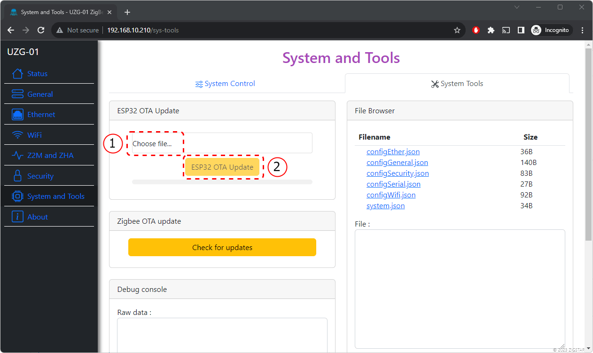{ data-title="UZG-01 ESP32 OTA Flashing" data-gallery="ota"}

4. Wait for the firmware to finish and reboot the device.

### Updating ESP32 via USB

If your UZG-01 device is not connected to LAN or you want to flash ESP32 via USB for other reasons, it can be easily done via USB cable. 

For this purposes you need:

- A computer with Windows or Mac installed
- USB - Type-C cable.

To flash via USB, follow these steps:

1. Download the flashing software. Recommended is ESP_Flasher,can be downloaded from [Official repository on Github](https://github.com/Jason2866/ESP_Flasher/releases);
2. Download the latest firmware version from [Official UZG-01 Firmware repository](https://github.com/mercenaruss/uzg-01-firmware/);
3. Using USB cable, connect UZG-01 to your computer;
4. Be sure, that you have downloaded and installed the drivers for USB/UART converter, built in to your UZG-01.
5. Run the ESP_Flasher program and
    - Select Serial-port in the Serial port section;
    - In the Firmware section, select the file with your firmware;
    - Press the "Flash ESP" button.

    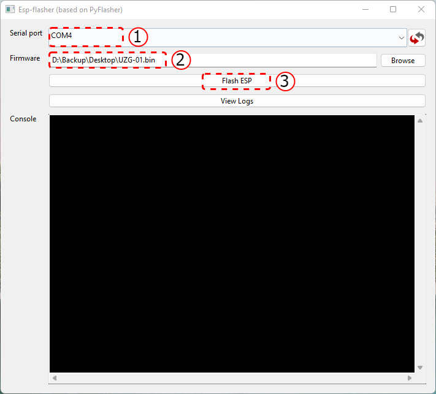{ data-title="ESP Flasher - settings" data-gallery="esp-flasher"}

6. Wait for the firmware to complete.

    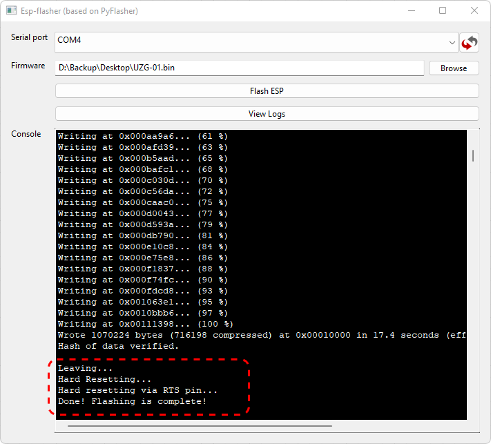{ data-title="ESP Flasher - complete" data-gallery="esp-flasher"}

## Update Zigbee CC2652P

User can flash Zigbee SoC (which is Texas Instruments CC2562P) any of the tools described at [Zigbee2MQTT](https://www.zigbee2mqtt.io/guide/adapters/#flashing-cc1352-cc2652-cc2538-based-adapters).

Below you can find detail manuals for few flashing options from those links.

### Over-the-Air (Ethernet) update  
!!! tip
    Update over Ethernet can be done distantly without a physical access to your device!
    
1. Download latest Zigbee firmware. UZG-01 Adapter is based on CC2652P from Texas Instruments. Firmware's are based on Z-Stack. You can see the best one here [Koenkk Z-Stack firmware on Github](https://github.com/Koenkk/Z-Stack-firmware/tree/master/coordinator/Z-Stack_3.x.0/bin). Use firmware with a tag **"..launchpad_coordinator_"**;
2. Download [ZigStar MultiTool](https://github.com/xyzroe/ZigStarGW-MT/releases/tag/v0.3.5) - choose the right version for your OS;
3. Connect your UZG-01 and PC with flashing firmware to the same LAN network over ethernet (cable) connection. It is important, as because WiFi can have some delays - it is incompatible for flashing. Flashing should be done only through ethernet connection;
4. Open Flashing tool and make te following settings:

    - IP address and port of your UZG-01 will be identified automatically `192.168.110.122:6638` (1) 
    { .annotate }
        1. **192.168.110.122** is an IP address and **6638** - port

    - click button `...` and select your Zigbee firmware, downloaded at stage 1;
    - Put active checkboxes `Erase`, `Write`, `Verify`, and `Auto BSL`;

    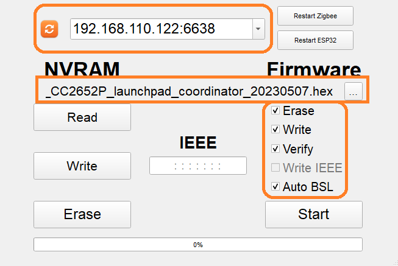{ data-title="Multi-Tool flasher - settings" data-gallery="multi-tool"}
    
    !!! warning
        Zigbee connectivity (e.g. Zigbee2MQTT or ZHA) should be disconnected. Flashing is impossible when the adapter is in *active* state.

    !!! danger
        It is crucial that you download the correct firmware for your gateway as using the wrong firmware will disable the BSL and you will need an external debugger / programmer to flash your gateway again.

5. Press `Start` button

    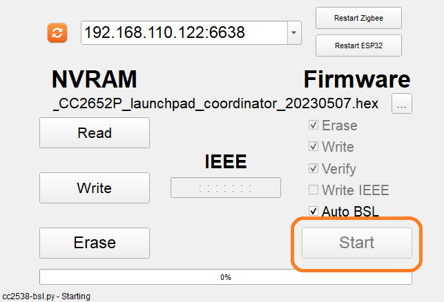{ data-title="Multi-Tool flasher - start flashing" data-gallery="multi-tool"}

6. Wait until the process is completed: the progress bar contains the message **"100%"** and below text **All is Ok. Restarting Zigbee**. Flashing takes about 8 minutes;

    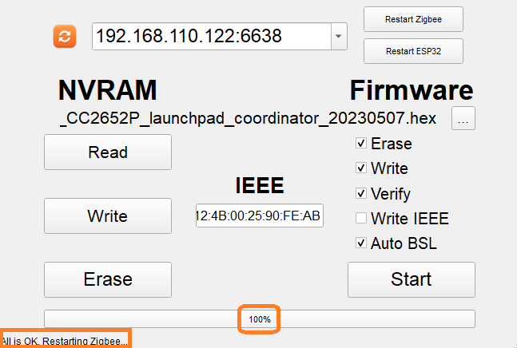{ data-title="Multi-Tool flasher - finish flashing" data-gallery="multi-tool"}

7. That is it. Flashing is done. You can use your device now with the new Zigbee firmware. Proceed with [installation](installation.md/#installation)
      
### Over-the-USB update

!!! tip
    Texas Instruments is a manufacturer of Zigbee SoC CC2652P which is used in UZG-01 adapter. The most "true" method is to use official flasher although it is more complicated process.

1. Download latest Zigbee firmware. UZG-01 Adapter is based on CC6252P from Texas Instruments. Firmware's are based on Z-Stack. You can see the best one here [Koenkk Z-Stack firmware on Github](https://github.com/Koenkk/Z-Stack-firmware/tree/master/coordinator/Z-Stack_3.x.0/bin). Use firmware with a tag **"..launchpad_coordinator_"**;
2. Download official Texas Instruments [Flash Programmer 2](https://www.ti.com/tool/FLASH-PROGRAMMER);
3. Install Flash Programmer 2;
4. Connect your UZG-01 to your network and USB port;
5. Be sure, that your PC has USB drivers and UZG-01 USB is recognized. If no, please install.
6. Change your UZG-01 mode to Zigbee-to-USB with active `Keep network & web server` at the `General` tab of the web-interface

    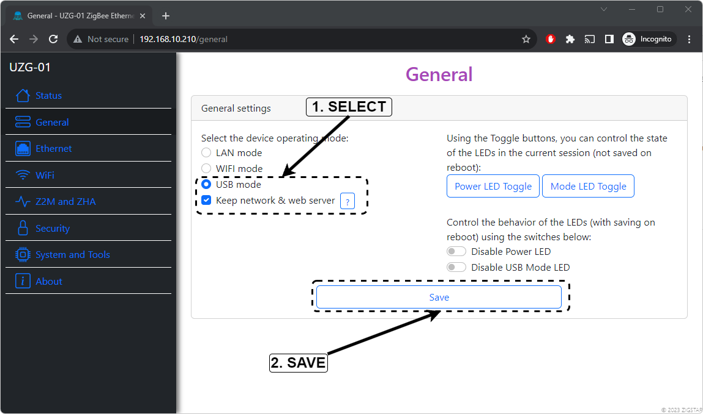{ data-title="Web Interface - Enable USB Mode" data-gallery="flash-programmer2"}

    !!! warning
        Web interface will be available after 1 min ~

7. At UZG-01 web-interface, go to the `System and Tools`, press button `Zigbee Flash Mode`

    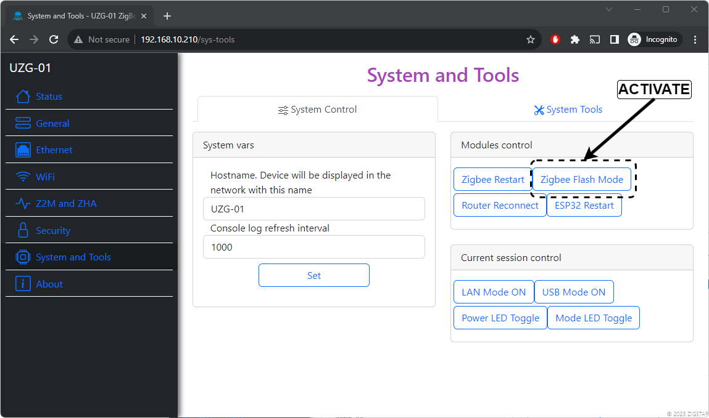{ data-title="Web Interface - Enable ZigBee Flash Mode" data-gallery="flash-programmer2"}

8. Open your Flash Programmer 2 from step 3. At the left window `Connected devices` click on `Unknown` and below at `Selected target` choose `CC2652P`;

    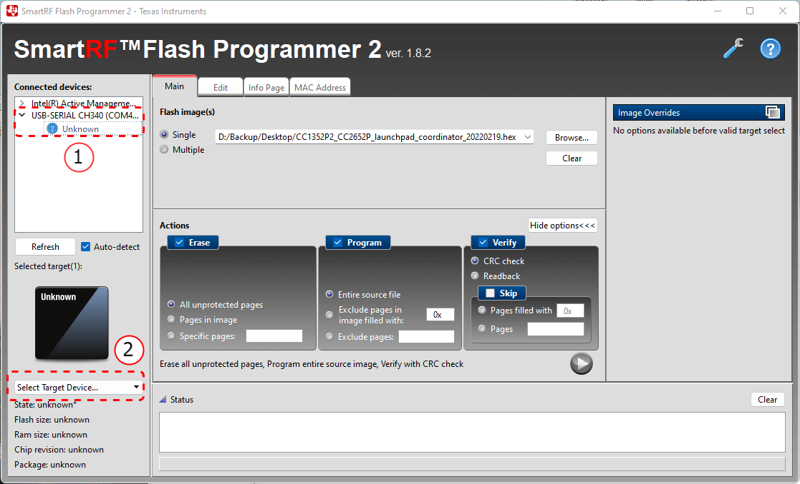{ data-title="Flash programmer 2 - to select target device" data-gallery="flash-programmer2"}

    You have to get the following:

    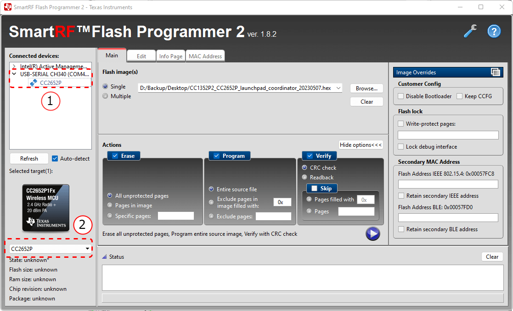{ data-title="Flash programmer 2 - target device selected" data-gallery="flash-programmer2"}

9. Do the following settings:

    - Select firmware file under the Flash images(s) with the option `Single`;
    - Make active checkboxes `Erase` (All unprotected pages), `Program` (Entire source file), `Verify` (CRC check)
    - Please very very careful, the `Disable bootloader` should remain **UNCHECKED**. Otherwise you will not be able to flash CC2652P via USB or LAN but just with external programmer;

    You have to get the following:

    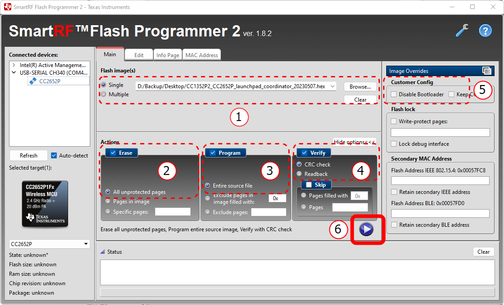{ data-title="Flash programmer 2 - setting" data-gallery="flash-programmer2"}

    - Press the `Start` button (with Triangular) to Start the flashing.

    !!! warning
        Zigbee connectivity (e.g. Zigbee2MQTT or ZHA) should be disconnected. Flashing is impossible when the adapter is in *active* state.

11. Wait until the message `Success!` is appeared at the progressbar and Status window states `Reset of target successful`. Flashing takes about 3 seconds;

     You have to get the following: 

    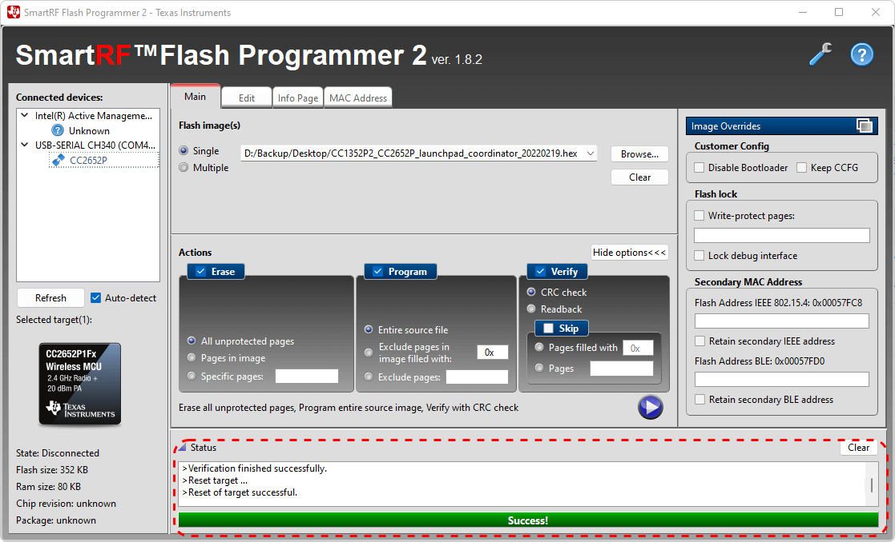{ data-title="Flash programmer 2 - finish flashing" data-gallery="flash-programmer2"}

12. That is it. Flashing is done. You can use your device now with the new Zigbee firmware. Proceed with [installation](installation.md/#installation)

### Update with HW flasher
UZG-01 adapter contains DIY pinouts that enable users to flash directly by J-TAG. Please note, that pin-outs are 2.54mm size. 

