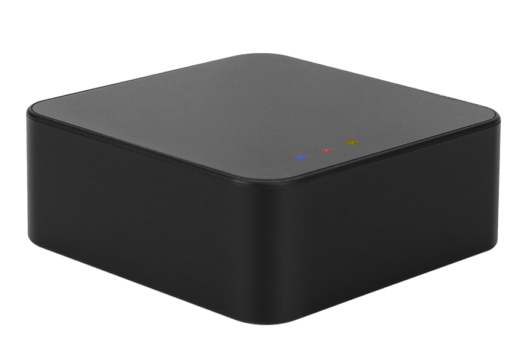

# Getting started

UZG-01 is Zigbee adapter, that enables Zigbee packet forwarding over Ethernet, WiFi or Serial (USB) connection, and serves as an access point in a Zigbee network. Zigbee adapter allows you to connect devices from different producers (Tuya, IKEA, Xiaomi, Gledopto, Moes, Sonoff and others) into one system. In order to properly use UZG-01 you need to have an instance of [Home Assistant](https://www.home-assistant.io/installation/) and [ZigBee2Mqtt](https://www.zigbee2mqtt.io/guide/installation/).

### What is in the box?
- 1 x UZG-01 Zigbee Ethernet PoE USB WiFi Adapter
- 1 x 3dB Antenna
- 1 x ZigStar Sticker

## Powering the device
Device can be powered by either PoE through Ethernet cable or by type-C plug.

!!! tip

    UZG-01 has optoelectronic isolation, so can be connected to USB port of your PC and at the same time to Ethernet/PoE cable!

## LED behaviour
- **Blue** LED is the power LED. Default operation: On when the unit is connected to a power source.
- **Red**  LED is the operation mode LED. Default operation: On when the device is in Zigbee-to-USB mode and off when the device is in Zigbee-to-Ethernet mode.
- **Yellow** LED - reserved for further work with Zigbee2MQTT

{ data-title="UZG-01 - LEDs on case" .skip-lightbox}

## Stick to wall

UZG-01 adapter can be attached to the wall, or anything else you want, with double-sided adhesive tape.
