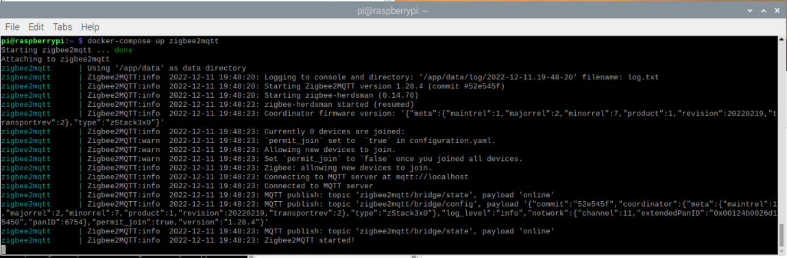

# Installation

You can use UZG-01 either as Zigbee to Ethernet adapter or as Zigbee to USB adapter. Depending on the type you are going to use, you can connect you device.


## Zigbee2MQTT Setup
### Connection over Ethernet

1. Plug in RJ45 cable to your device. 

    !!! tip

        UZG-01 has optoelectronic isolation, so can be connected to USB port of your PC and at the same time to Ethernet/PoE cable!


2. Follow Zigbee2MQTT set-up process [official guideline](https://www.zigbee2mqtt.io/guide/configuration/adapter-settings.html). You can set-up as a linux package, docker container oextension     for Home Assistant. 
3. Use the following lines in `port:` settings:
```yaml
serial:
  port: tcp://192.168.0.105:6638
```
where 
    -   `192.168.0.105` is an IP address of UZG-01 in your network;
    -   `6638` is a port of your UZG-01 adapter (default is **6638**, can be configured from Web Interface);

    !!! tip

        Zigbee2MQTT supports mDNS Zeroconf Autodiscovery for UZG-01 adapter. If you do not know actual IP address of your UZG-01, you can put `port: mdns://zigstar-gw` ,please refer to official web page of [Zigbee2MQTT mDNS settings here](https://www.zigbee2mqtt.io/guide/configuration/adapter-settings.html#mdns-zeroconf-discovery)

    In case of mDNS Zeroconf autodiscovery, your Zigbee2MQTT serial's settings should looks like:


    ```yaml
      serial:
        port: mdns://zigstar-gw
    ```

4. Run Zigbee2MQTT.  

### Connection over USB

1. Plug in type-C cable to the device.
    !!! tip
        UZG-01 has optoelectronic isolation, so can be connected to USB port of your PC and at the same time to Ethernet/PoE cable!

    !!! warning
        **DRIVERS for USB/UART converter**! UZG-01 uses CH340C as an USB/UART chip. If your system does not recognize the device, you have to install the drivers. We recommend to use the drivers from [CH34x (rectangular chip)](https://github.com/nodemcu/nodemcu-devkit/tree/master/Drivers)!

2. Follow Zigbee2MQTT set-up [official guideline](https://www.zigbee2mqtt.io/guide/configuration/adapter-settings.html). You can set-up as a linux package, docker container or extension for Home Assistant. 
3. Use the following lines in `port:` settings:

    ```yaml
    serial:
      port: /dev/ttyUSB0
    ```
    where:

    - `/dev/ttyUSB0` is an ID of UZG-01 device within your system

### Running Z2M in a Docker
Sample `docker-compose` settings that were tested successfully:
```yaml
version: '3'
services:
  zigbee2mqtt:
    container_name: zigbee2mqtt
    image: koenkk/zigbee2mqtt
    restart: unless-stopped
    network_mode: host
    privileged: true
    environment:
      - TZ=Europe/Berlin
    volumes:
      - /run/udev:/run/udev:ro
      - /home/pi/docker-containers/zigbee2mqtt:/app/data
```

{ data-title="UZG-01 Zigbee2MQTT in Docker" .skip-lightbox}
 
Key parameters and their definitions:

-   `network_mode: host` - means that your containers has the same access as the host machine. 
-   `privileged: true` - allows your container to access your host devices, important if you are using a USB connection.
-   `/home/pi/docker-containers/zigbee2mqtt` is a location of your Zigbee2MQTT configuration.yaml file.


## ZHA (Zigbee Home Automation) Setup
### Autodiscovery
Home Assistant version 2023.1 and above contains LAN autodiscovery feature for UZG-01. If mDNS is allowed by your network router, the set-up is straightforward:

1. Run your Home Assistant
2. Plug-in your UZG-01 to LAN (either by Ethernet or WiFi).
3. Home Assistant will makes notification that new supported device is found and will propose to set it up. 
    Confirm it and that is it - UZG-01 is integrated into your Home Assistant thought ZHA integration.

### Manual set-up
1. Go to Home Assistant
2. Click `Settings`
3. Go to `Devices & Services`
4. Click `Add integration` (right bottom corner)
5. Find «Zigbee Home Automation», click on it;
6. Between two options «Add Zigbee device» and «Zigbee Home Automation» choose `Zigbee Home Automation`;
7. Select serial port window - `Enter manually`
8. Radio type window - `ZNP = Texas Instruments Z-Stack ZNP … `
9. Serial port settings window
      - Serial device path: « socket://192.168.1.105:6638 », where 192.168.1.105 is IP address of your UZG-01;
      - port speed left by default 115200;
      - data flow control undefined (it does not matter for LAN adapters)
10. Press `Submit`.
11. Network formation window - `Erase network settings and form a new network`
12. Wait for Zigbee network and try to add some Zigbee end-device (e.g. sensor etc)
