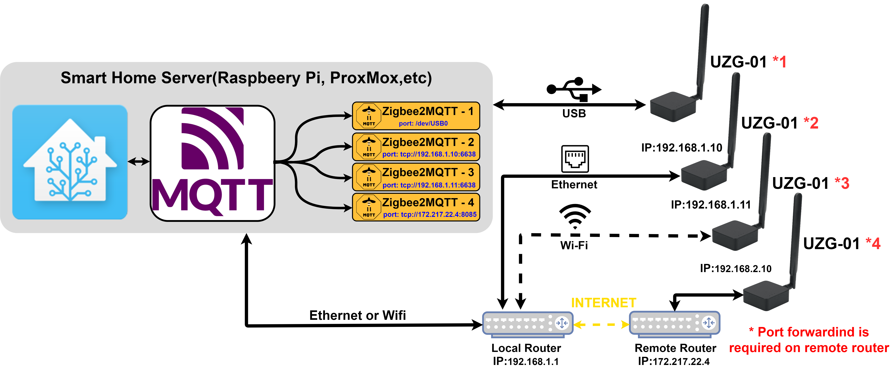

# Multiple gateways setup
Sometimes the system architecture requires to manage several UZG-01 Zigbee coordinators under one instance of Home Assistant. Such cases includes but not limited:

- cover remote locations in you apartment, or different floor of basement etc;
- cover remote building like garage etc via LAN connection;
- cover remote location like summer house via Internet remote;
- if you have "unstable" end-devices and want to segregate them from the main Zigbee network;
- if you want to have a "guest" Zigbee network for testing and DIY works;

The user can connect any number of UZG-01 coordinators to a single Home Assistance instance. 
Coordinators can work simultaneously:

- connected via USB cable;
- connected via Ethernet or WiFi in a local network (either with PoE power supply or type-C power supply);
- connected via Ethernet or WiFi in a remote network via an Internet connection (either with PoE power supply or type-C power supply).  

Possible connection scenarios and the architecture of the multi-coordinator system are shown in the figure below.  

{ data-title="UZG-01 - Multiple Zigbee coordinators in one Home Assistant and Zigbee2MQTT" }

Number of UZG-01 Coordinators is not limited, you can link as many as you need.  

!!! tip
    Each coordinator will create a separate Zigbee network. For end-user it does not matter, as no difference for Home Assistant where the end devices are connected to. The only can be matter if you are using direct binding, so devices with direct binding have to be connected to the same network.

In order to run several coordinators you have to:

- install and run several instances of Zigbee2MQTT on your server;
- make config of each Zigbee2MQTT according to your adapter settings, e.g. put IP address to this part of Zigbee2MQTT config:

```yaml
data_path: /config/zigbee2mqtt_1
mqtt:
  base_topic: zigbee2mqtt_1
serial:
  port: tcp://192.168.0.105:6638
advanced:
  pan_id: 6754
  chanel: 11
```
where:

- `/config/zigbee2mqtt_1` - set up unique path to each Zigbee2MQTT instance

    ??? tip "Path Example"
        Use `/config/zigbee2mqtt_1` for Zigbee2MQTT instance #1, `/config/zigbee2mqtt_2` for Zigbee2MQTT instance #2 etc

- `mqtt:   base_topic: zigbee2mqtt_1` - unique MQTT topic for each Zigbee2MQTT instance

    ??? tip "Topic example"
        Use `base_topic: zigbee2mqtt_1`for Zigbee2MQTT instance #1, `base_topic: zigbee2mqtt_2` for Zigbee2MQTT instance #2 etc

- `192.168.0.105` is an IP address of UZG-01 in your network;
- `6638` is a port of your UZG-01 adapter (default is **6638**, can be configured in web interface);
- `pan_id: 6754` - unique PAN ID (ID of the Zigbee network) for each Zigbee2MQTT instance

    ??? tip "PAN_ID Example"
        Use `6754` for Zigbee2MQTT instance #1, `6755` for Zigbee2MQTT instance #2 etc; `pan_id` can be ANY 4 digits

- `chanel: 11` - Zigbee network channel.

    !!! tip "Channel Recommendations"
        Like WiFi networks, each network performs on its own network. It is possible if Zigbee networks work on the same channel, however it is recommended to use different channels.
        Please follow [Zigbee2MQTT guide](https://www.zigbee2mqtt.io/guide/configuration/zigbee-network.html#network-config) for more description of config settings.
        Read our [FAQ](faq-and-lifehacks.md/#best-channel-for-a-zigbee-network) for more detail on ZigBee Channels.

!!! warning
    If you are going to use remote UZG-01 Zigbee coordinator with access through Internet, we recommend to secure your access to remote device by any available means

