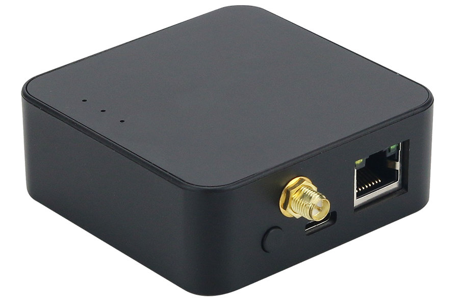
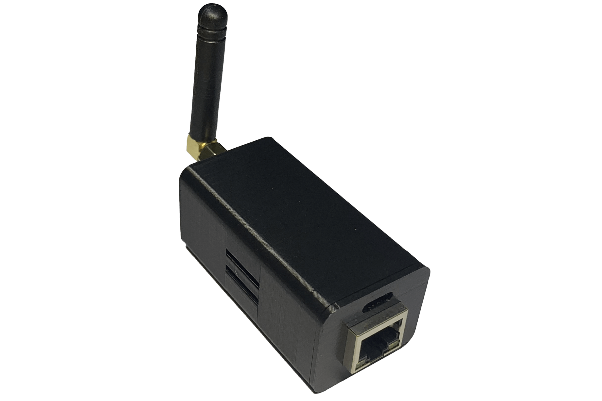
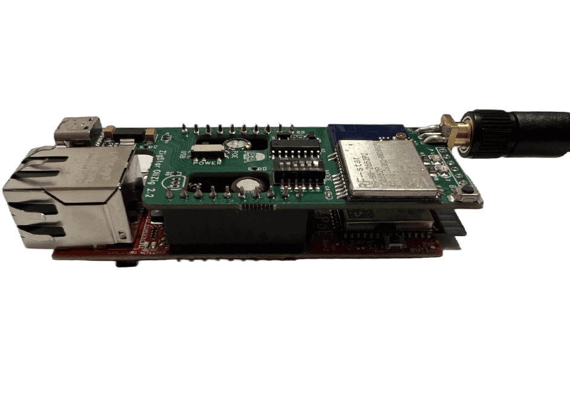
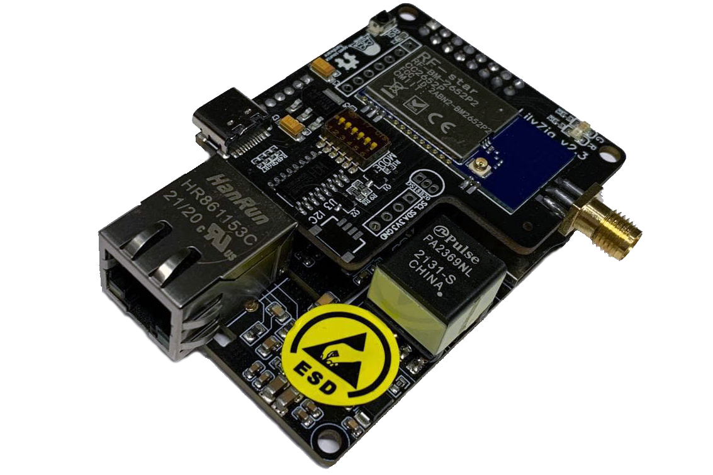
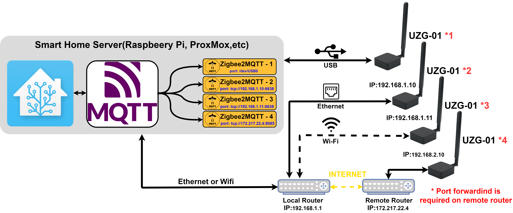

  

    

      
    

    

      
    

    

      
    

    

      
    

  

  

  

  

## FEATURES

::cards:: cols=4 image-bg

- title: LAN or USB
  content: Utilize the UZG-01 as ZigBee 3.0 connectivity over LAN or USB interface. 

- title: PoE Power
  content: Power the UZG-01 through either USB-C Type connection or PoE 802.3af. 

- title: +20dB Amplifier
  content: The CC2652P incorporates a 20dB amplifier

- title: Coordinator or Router
  content: It supports both Coordinator and Router modes.

::/cards::

## FIRMWARE

::cards:: cols=4 image-bg

- title: Pre-flashed
  content: It's a straightforward Plug & Play experience, upon receiving the UZG-01, it comes pre-flashed and ready for immediate use. 

- title: Open Source
  content: The firmware for the UZG-01 is open source, offering flexibility for modifications as needed.

- title: Adjustable
  content: Transitioning from USB to LAN for the working mode is possible. 

- title: Secure
  content: Secure access control is implemented for Zigbee and Web functions, requiring a login and password for entry. 

::/cards::

## CHIPSET'S & TECH

::cards:: cols=4 image-bg

- title: CC2652P
  content: It features the most powerful ZigBee Chip from TI, renowned for its proven performance over time.

- title: ESP32
  content: The gateway is controlled by the Esspressif ESP32 chip.

- title: LAN8720
  content: The Ethernet System-on-Chip (SoC) ensures a stable LAN connection.

- title: CH340C
  content: It utilizes the UART converter CH340C.

::/cards::

## UPDATES

::cards:: cols=4 image-bg

- title: Remote Zigbee Update
  content: You can update the Zigbee 3.0 firmware over LAN/Internet.

- title: Remote ESP32 Update
  content: ESP32 can be updated remotely, putting you in control of the process.

- title: ESP32 Auto-boot 
  content: Simply plug in your USB-C cable and initiate the flashing process.

- title: DIY Pinouts
  content: Enthusiasts are all set,it includes pinouts for both ESP32 and CC2652P.

::/cards::

## USER FRIENDLY

::cards:: cols=4 image-bg

- title: Simple to set up
  content: Do you prefer to mount it on the wall or below the table? Stick it with two-sided tape.

- title: Clear instructions
  content: Not sure where to begin? No problem, we provide you with a comprehensive guide.
  url: getting-started.md

- title: 3dbi antenna
  content: Strong antenna 3 dBi antenna provided.

- title: Compact shape
  content: You can place UZG-01 wherever you like. With few exceptions. 73x72x27mm

::/cards::

## OTHER

::cards:: cols=4 image-bg

- title: 3 x LED
  content: 3 LEDs on UZG-01 enable user feedback and alerts.

- title: Button
  content: Use the button to change device settings such as RESET, MODE, LEDS.

- title: Adjustable antenna
  content: For optimal signal, position the antenna as you prefer.

- title: Made in Germany
  content: UZG-01 is designed, developed, tested and assembled in Germany.

::/cards::
## SPECS

!!! col _2
    | UZG-01 Specifications      |                          |
    | ----------- | ------------------------------------ |
    |Main Zigbee 3.0 chip |	:fontawesome-solid-microchip: CC2652P Texas Instruments |
    |Primary control chip |	:fontawesome-solid-microchip: ESP32 Espressif |
    |USB/UART converter |	:material-chip: CH340C |
    |Ethernet SoC |	:fontawesome-solid-microchip: LAN8720 |
    |Zigbee SoC output gain |	:material-wifi: +20dB |
    |Antenna gain	| :material-antenna: +3dBi |
    |Ethernet supported |	:material-ethernet: Yes |
    |WiFi supported	| :material-wifi: Yes |
    |PoE supported	| :material-power-settings: Yes |
    |PoE standard supported	| :material-standard-definition: IEEE 802.3af (15W) |
    |USB Type-C control	| :material-usb: Yes |
!!! col _2
    | UZG-01 Specifications       |                           |
    | ----------- | ------------------------------------ |
    |ESP32 Flasher present	| :material-integrated-circuit-chip: Yes, based on CH340C |
    |ESP32 Auto-boot	| :material-bootstrap: Yes, through DTR / RTS |
    |Pre-flashed	| :material-hand-okay: Yes, Zigbee and ESP |
    |Zigbee 3.0 Coordinator mode	| :octicons-checkbox-16: Yes |
    |Zigbee 3.0 Router mode	| :octicons-checkbox-16: Yes |
    |Zigbee to Ethernet	| :octicons-checkbox-16: Yes |
    |Zigbee to USB	| :octicons-checkbox-16: Yes |
    |Zigbee2MQTT supported	| :octicons-checkbox-16: Yes |
    |ZHA supported	| :octicons-checkbox-16: Yes |
    |Small design	| :octicons-checkbox-16: Yes |
    |Open source firmware	| :octicons-checkbox-16: Yes |

## COMPARE

| Features    | UZG-01 { align=center width="300" }  | [LAN Gateway](https://zig-star.com/projects/zigbee-gw-lan/) { align=center width="300" }    | [Olizig PoE](https://zig-star.com/projects/zigstar-olizig/) { align=center width="300" }   | [LilyZig PoE](https://zig-star.com/projects/zigstar-lilyzig/) { align=center width="300" }  
| :----------- | :----: | :----: | :----: | :----: |
|Is Zigbee-to-Ethernet functionality supported?	| :white_check_mark: | :white_check_mark: | :white_check_mark: | :white_check_mark: |
|Can the Ethernet/USB mode be changed remotely via web interface, eliminating the need for physical switches?	| :white_check_mark: | :no_entry: | :no_entry: | :no_entry: |
|Is the UZG-01 built on the high-performance CC2652P Zigbee chip recommended by Zigbee2MQTT?	| :white_check_mark: | :white_check_mark: | :white_check_mark: | :white_check_mark: |
|Is there no requirement to manually switch the physical switch between POE and USB power sources?| :white_check_mark: | :no_entry: | :no_entry: | :no_entry: |
|Features optoelectronic isolation between Ethernet and USB, allowing secure simultaneous connections of both RJ45 and type-C interfaces.	| :white_check_mark: | :no_entry: | :white_check_mark: / :no_entry: | :no_entry: |
|Are the ESP32 and CC2652P integrated as chips on a single board, enhancing system stability, rather than being a combination of separate modules on the board?	| :white_check_mark: | :no_entry: | :no_entry: | :no_entry: |
|Does it feature a compact design suitable for installation in confined spaces?	| :white_check_mark: | :white_check_mark: | :white_check_mark: | :no_entry: |
|Does it come with a factory enclosure?	| :white_check_mark: | :no_entry: | :no_entry: | :no_entry: |
|Is there a peripheral built on the ESP32?	| :white_check_mark: | :white_check_mark: | :white_check_mark: | :white_check_mark: |
|Does it support the ESP32 auto-boot mode for flashing via Type-C connection?	| :white_check_mark: | :white_check_mark: | :white_check_mark: | :white_check_mark: |

## FAQ 
??? question "Is the UZG-01 compatible with Home Assistant without requiring additional setup?"
    Indeed, it does. Simply connect the UZG-01 to your LAN Ethernet or USB, and you're all set. The UZG-01 comes pre-flashed and prepared for immediate use. Go to [installation](installation.md) 

??? question "Is it possible to configure more than one UZG-01 coordinator with a single instance of Home Assistant?"
    Certainly, that's possible. You have the ability to establish numerous UZG-01 coordinators alongside a single Home Assistant setup. To achieve this, all you need to do is execute distinct instances of Zigbee2MQTT for each coordinator. 
    According to user reports, approximately 6-8 ZigStar LAN devices have been successfully employed in conjunction with a single Home Assistant setup. Furthermore, it's worth noting that you have the capability to link with devices situated beyond your LAN network, such as those located in different geographical locations with internet access. Further information can be located [HERE](multiple-gateways-setup.md). 
    The overarching system architecture when incorporating multiple adapters appears as follows: 
    { loading=lazy width="900" }

??? question "What method is used to choose between USB and Ethernet modes? Are there any physical switches involved?"
    The device offers the option to switch between USB and Ethernet modes using either a web interface or a physical button. A brief press of the button is all it takes to switch modes. Opting for the web interface enables remote switching of the operating mode.

??? question "Is it necessary to manually adjust the power source, switching between POE and USB? Does this involve using a switch of some kind?"
    No, there's no need for that. You don't have to worry about it, and there's no involvement of switches. Simply connect the device using either POE or type-C, or even both, and the device will function seamlessly.

??? question "Is it possible to remotely update the firmware of the UZG-01 without needing physical access to the device?"
    Certainly, you have the capability to do so. The two main chips employed in the UZG-01 (CC2652P and ESP32) can both be updated remotely from a different location. This feature makes the device well-suited for installation in infrequently accessed or remote locations.

??? question "Is POE (Power over Ethernet) supported for powering this device?"
    Absolutely, it supports the POE standard IEEE 802.3af for powering. This is a widely used standard. You can simply plug in and utilize the device without requiring any extra power cables or plugs. 

??? question "What is ESP32 Autoboot feature?"
    Indeed, ESP32 Autoboot is a default feature when flashing the UZG-01 using the type-C connection. In this context, ESP32 Autoboot refers to the built-in programming mechanism and circuitry that simplifies the process of flashing the ESP32 microcontroller. With this feature, you are not required to manually press buttons to put the ESP32 in flash mode, and you also don't need to connect additional programming tools. The process is streamlined – just connect the type-C cable and initiate the flashing process. This streamlined approach makes flashing the device straightforward and convenient.

??? question "Is it possible to simultaneously connect both the type-C and RJ45 interfaces? Is there optoelectronic isolation in place to facilitate this dual connection?"
    Absolutely, the device incorporates optoelectronic isolation between the USB and Ethernet components. As a result, you can indeed connect the UZG-01 to both RJ45 and type-C interfaces simultaneously without any issues.

??? question "Is it capable of functioning as a Zigbee-to-WiFi adapter?"
    Yes, it is technically possible, but it's not recommended due to potential issues such as increased latency (ping) and the possibility of lost packages.

